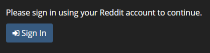
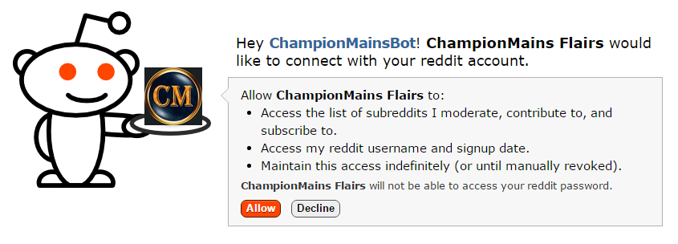
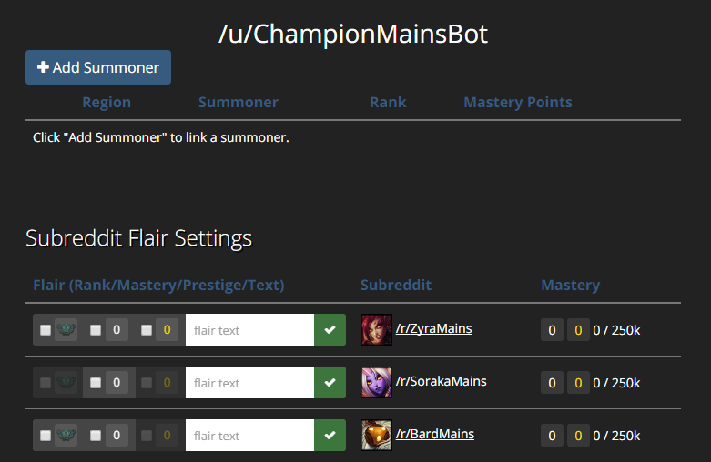
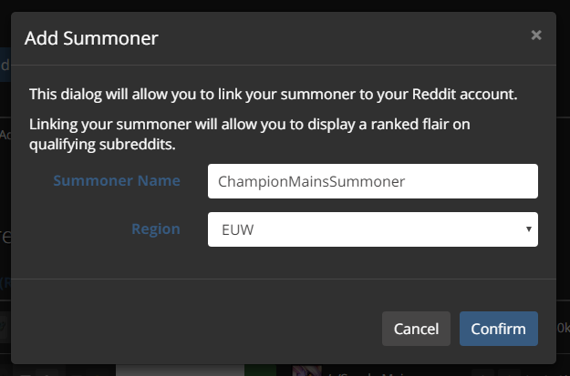
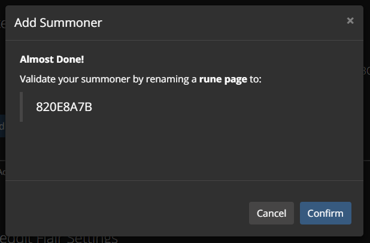
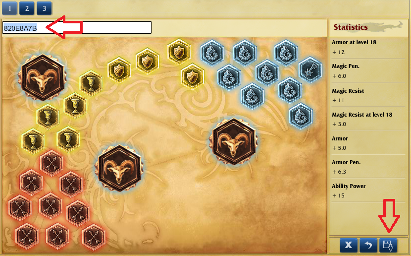
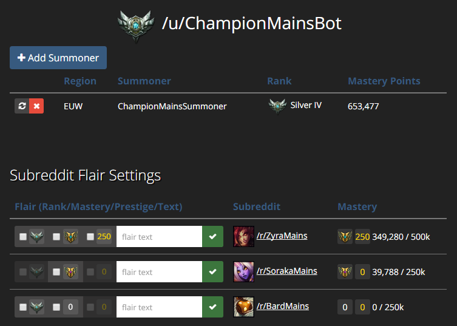
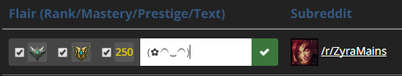
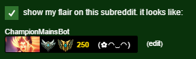

# Contents
- #### [Frequently Asked Questions](#faq)
  - ##### [What is this?](#what)
  - ##### [Who made this?](#maker)
  - ##### [Do we really need this?](#need)
  - ##### [Will my flair update when I change rank/mastery?](#automation)
  - ##### [What is a /r/ChampionMains subreddit?](#championmains)
  - ##### [What is a Mastery Points Leaderboard?](#leaderboard)
  - ##### [How was this made?](#how-made)
  - ##### [Which subreddits can I use this on?](#which-subs)
  - ##### [I don’t want this. I’m happy with the flairs as they are.](#plsno)
  - ##### [I like being able to show my rank, but I don’t want to show my mastery level...(or vice-versa)](#options)
  - ##### [Is it secure?](#security)
  - ##### [Help! I've lost my Reddit account and can't re-verify my summoner, what do I do?](#deleted-account)
- #### [Usage Manual](#manual)
  - ##### [Signing-in](#login)
  - ##### [Adding Summoners](#add-summoner)
  - ##### [Setting your flairs](#set-flair)

* * *

# Frequently Asked Questions
{:id="faq" name="faq"}

## What is this?
{:id="what" name="what"}

This is a service which enables user flairs on participating /r/ChampionMains subreddits which
indicates your League of Legends ranked tier, champion mastery level, and champion mastery
points.

## Who made this?
{:id="maker" name="maker"}

This site was made by [/u/LugnutsK](https://www.reddit.com/u/LugnutsK), and is a heavily modified
version of [this service](https://summonerschool.reddit.com/comments/3z0bzu/) made by
[/u/Kivinkujata](https://www.reddit.com/u/Kivinkujata).

## Do we really need this?
{:id="need" name="need"}

> No
>
> _-[/u/LugnutsK](https://www.reddit.com/u/LugnutsK)_

The site creates a way to recognize high-achieving members of ChampionMains subreddits, through
“Mastery Points Leaderboards” and special flairs, without creating a hastle for moderators.

## Will my flair update when I change rank/mastery?
{:id="automation" name="automation"}

Yes. Every hour, the bot runs a job that looks for flairs that haven't been updated in six hours,
and updates them. If you don't want to wait, you can log-in and click the update buttons next to
each summoner and subreddit.

## What is a [/r/ChampionMains](https://ChampionMains.reddit.com/) subreddit?
{:id="need" name="need"}

Each ChampionMains Subreddit is dedicated to a single League of Legends champion. For example,
people use [/r/ZyraMains](https://ZyraMains.reddit.com/) to discuss and share Zyra-related
content.

## What is a Mastery Points Leaderboard?
{:id="leaderboard" name="leaderboard"}

> The Mastery Points Leaderboard was an idea brought to me by /u/Deejayce who was Moderator of
> /r/VarusMains. He wanted a leaderboard where Varus players could display their mastery and sort of
> compete with each other to have the most or a significant number of mastery points on their
> champion.
>
> _-[/u/Umarrii](https://www.reddit.com/u/Umarrii)_

## How was this made?
{:id="how-made" name="how-made"}

> I was playing around with a way to give users multiple flair parts, such as one normal part with
> a banner image, and another part with League rank, and another with champion mastery. However,
> it was too much of a hastle for moderators (and also users) to manually set up every flair
> through PMs. After seing the /r/SummonerSchool bot in action, and that the source was available
> online, I decided to try to adapt the bot for our purposes. This is the result.
>
> The source is available [at GitHub](https://github.com/championmains/Pyrobot)
>
> _-[/u/LugnutsK](https://www.reddit.com/u/LugnutsK)_

## Which subreddits can I use this on?
{:id="which-subs" name="which-subs"}

The list of available subreddits is visible on the page after you log in.

If you’re a moderator of a ChampionMain subreddit (or another League of Legends subreddit) and wish
for this to be added to your subreddit, send [/u/LugnutsK](https://www.reddit.com/u/LugnutsK) a
message to let him know!

## I don’t want this. I’m happy with the flairs as they are.
{:id="plsno" name="plsno"}

That's fine. Unlike with the /r/SummonerSchool bot, you will still be able to set your flairs
normally. If you no longer want to use the service, you can remove your summoners and disable the
flairs for each subreddit.

This should never harm your ChampionMains experience. Any negative comments, such as derogatory
remarks about a user's rank or champion mastery, should be reported to the subreddit's moderation
team. Such comments will be removed, and appropriate action will be taken.

## I like being able to show my rank, but I don’t want to show my mastery level... (or vice-versa)
{:id="options" name="options"}

On your profile under the ‘Subreddit Flair Settings’ you can set which icons are displayed on your
flair. You can tick/untick the boxes to show/hide that icon and manage them for each Champion Main
subreddits.

Note that subreddit moderators have the option to require both to be required if

## Is it secure?
{:id="security" name="security"}

Yes. This site only stores your Reddit username, League of Legends rank and champion mastery info,
and subreddit flair settings. Linkage to Reddit and Riot occur through official, secure, methods,
which only reveal publicly available information.

The source is available [at GitHub](https://github.com/championmains/Pyrobot). If you find any
issues or have a suggestion, submit it to the
[issues page](https://github.com/championmains/Pyrobot/issues). If you would like to contribute
directly, fell free to send a pull request.

## Help! I've lost my Reddit account and can't re-verify my summoner, what do I do?
{:id="deleted-account" name="deleted-account"}

Message [/u/LugnutsK](https://reddit.com/u/LugnutsK) with your *summoner name* and *region*.

* * *

# Usage Manual
{:id="manual" name="manual"}

## Signing-in
{:id="login" name="login"}

Click the sign-in button on the index page to begin.

{:class="img-thumbnail"}

This is an official Reddit OAuth2 portal, and only gives this site publicly available information.
Click allow.

{:class="img-thumbnail"}

You will now see your profile page. On the top half of the page is a list of linked summoners, which
is currently empty. On the bottom half is a list of subreddits.

To the left of each subreddit name is a mini-form where you change your flair settings. The three
check buttons correspond to rank, champion mastery level, and champion mastery prestige. Prestige
shows people who have over 250,000 champion mastery points. The greyed-out check boxes have been
disabled by subreddit moderators.

Because there aren't any linked summoners, you will be unranked, and your champion mastery will show
up as zero.

{:class="img-thumbnail"}

## Adding Summoners
{:id="add-summoner" name="add-summoner"}

Click the "Add Summoner" button. This will bring up a dialog asking for your summoner's basic
information: name and region. Enter your information, then click "confirm".

{:class="img-thumbnail"}

The site will then generate a random code to validate your summoner. You will need to go to your
League of Legends client and rename a rune page to the code.

{:class="img-thumbnail"}

In your League client, click the rune page title bar and enter your validation code, then click the
floppy disk button in the bottom right corner to save. You will be able to change the name back
after you validate.

{:class="img-thumbnail"}

Go back to the website, and click the "confirm" button. If successful, you should now see your
summoner in the list. The rank and mastery points should load in soon after. You can now change back
your rune page name if you wish.

The summoner info will refresh nightly. If you wish to refresh it manually, you can click the button
on the left with the refresh icon. If you want to remove the summoner, click the red "x" button.

You can add as many summoners as you like, and the site will automatically add up your champion
mastery points. The rank shown will be the highest rank of all your summoners.

{:class="img-thumbnail"}

## Setting your flairs
{:id="set-flair" name="set-flair"}

Go to the subreddit you want to set your flair for. Click the checkboxes on the left to set enable
or disable different parts of the flair. Enter your flair text in the textbox to the right.

{:class="img-thumbnail"}

Click the checkmark button on the right to have the bot update your flair. The bot will preserve
your existing flair image. In a few moments, the Reddit flair will be updated.

If you change your flair image or flair text, the bot will re-add the rank/mastery/prestige,
but preserve the changes.

{:class="img-thumbnail"}
