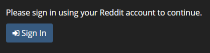
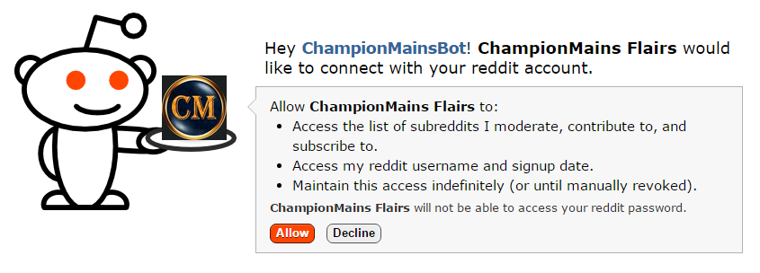

# Contents
- #### [Frequently Asked Questions](#faq)
  - ##### [What is this?](#what)
  - ##### [Who made this?](#maker)
  - ##### [Do we really need this?](#need)
  - ##### [Will my flair update when I change change rank/mastery?](#automation)
  - ##### [What is a /r/ChampionMains subreddit?](#championmains)
  - ##### [What is a Mastery Points Leaderboard?](#leaderboard)
  - ##### [How was this made?](#how-made)
  - ##### [Which subreddits can I use this on?](#which-subs)
  - ##### [I don’t want this. I’m happy with the flairs as they are.](#plsno)
  - ##### [I like being able to show my rank, but I don’t want to show my mastery level...(or vice-versa)](#options)
  - ##### [Is it secure?](#security)
- #### [Usage Manual](#manual)
  - ##### [Signing-in](#login)

* * *

# Frequently Asked Questions
{:id="faq" name="faq"}

## What is this?
{:id="what" name="what"}

This is a service which enables user flairs on participating /r/ChampionMains subreddits which
indicates your League of Legends ranked tier, champion mastery level, and champion mastery
points.

## Who made this?
{:id="maker" name="maker"}

This site was made by [/u/LugnutsK](https://www.reddit.com/u/LugnutsK), and is a heavily modified 
version of [this service](https://summonerschool.reddit.com/comments/3z0bzu/) made by
[/u/Kivinkujata](https://www.reddit.com/u/Kivinkujata).

## Do we really this?
{:id="need" name="need"}

> No
>
> _-[/u/LugnutsK](https://www.reddit.com/u/LugnutsK)_

The site creates a way to recognize high-achieving members of ChampionMains subreddits, through
“Mastery Points Leaderboards” and special flairs, without creating a hastle for moderators.

## Will my flair update when I change change rank/mastery?
{:id="automation" name="automation"}

Yes. The bot updates everyone's flairs every 24 hours at around 10 AM UTC. If you don't want to
wait, you can log-in and click the update buttons next to each summoner and subreddit.

## What is a [/r/ChampionMains](https://ChampionMains.reddit.com/) subreddit?
{:id="need" name="need"}

Each ChampionMains Subreddit is dedicated to a single League of Legends champion. For example,
people use [/r/ZyraMains](https://ZyraMains.reddit.com/) to discuss and share Zyra-related
content.

## What is a Mastery Points Leaderboard?
{:id="leaderboard" name="leaderboard"}

> The Mastery Points Leaderboard was an idea brought to me by /u/Deejayce who was Moderator of
> /r/VarusMains. He wanted a leaderboard where Varus players could display their mastery and sort of
> compete with each other to have the most or a significant number of mastery points on their
> champion.
>
> _-[/u/Umarrii](https://www.reddit.com/u/Umarrii)_

## How was this made?
{:id="how-made" name="how-made"}

> I was playing around with a way to give users multiple flair parts, such as one normal part with
> a banner image, and another part with League rank, and another with champion mastery. However,
> it was too much of a hastle for moderators (and also users) to manually set up every flair
> through PMs. After seing the /r/SummonerSchool bot in action, and that the source was available
> online, I decided to try to adapt the bot for our purposes. This is the result.
> 
> The source is available [at GitHub](https://github.com/championmains/Pyrobot)
>
> _-[/u/LugnutsK](https://www.reddit.com/u/LugnutsK)_

## Which subreddits can I use this on?
{:id="which-subs" name="which-subs"}

The list of available subreddits is visible on the page after you log in.

If you’re a moderator of a ChampionMain subreddit (or another League of Legends subreddit) and wish
for this to be added to your subreddit, send [/u/LugnutsK](https://www.reddit.com/u/LugnutsK) a
message to let him know!

## I don’t want this. I’m happy with the flairs as they are.
{:id="plsno" name="plsno"}

That's fine. Unlike with the /r/SummonerSchool bot, you will still be able to set your flairs 
normally. If you no longer want to use the service, you can remove your summoners and disable the
flairs for each subreddit.

This should never harm your ChampionMains experience. Any negative comments, such as derogatory
remarks about a user's rank or champion mastery, should be reported to the subreddit's moderation
team. Such comments will be removed, and appropriate action will be taken.

## I like being able to show my rank, but I don’t want to show my mastery level... (or vice-versa)
{:id="options" name="options"}

On your profile under the ‘Subreddit Flair Settings’ you can set which icons are displayed on your
flair. You can tick/untick the boxes to show/hide that icon and manage them for each Champion Main
subreddits.

Note that subreddit moderators have the option to require both to be required if 

## Is it secure?
{:id="security" name="security"}

Yes. This site only stores your Reddit username, League of Legends rank and champion mastery info,
and subreddit flair settings. Linkage to Reddit and Riot occur through official, secure,
methods---the same ones used by Reddit bots (like AutoModerator) and League fansites (like
LolKing).

The source is available [at GitHub](https://github.com/championmains/Pyrobot). If you find any
issues or have a suggestion, submit it to the
[issues page](https://github.com/championmains/Pyrobot/issues). If you would like to contribute
directly, fell free to send a pull request.

* * *

# Usage Manual
{:id="manual" name="manual"}

## Signing-in
{:id="login" name="login"}

### Click the sign-in button

Click the sign-in button on the index page to begin.

{:class="img-thumbnail"}

### Log in using your Reddit account

This is an official Reddit OAuth2 portal, and only gives this site publicly available information.
Click allow.

{:class="img-thumbnail"}

### Profile Page

* * *

> Finally everyone knows how massive my dick is, thanks to the flairbot, thanks LUGNUTSK
>
> _-Michael Scott_

