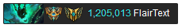
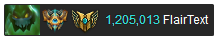
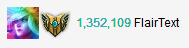
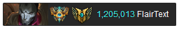
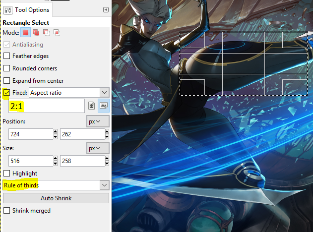

# Guide for Subreddit Mods

Hey guys, it's [/u/LugnutsK](https://www.reddit.com/user/lugnutsk).

Generating the fancy flairs for a new sub is actually a pretty involved process, so I
haven't been able to keep up with the requests lately. The main two parts of making the
flairs are cropping the images and generating the CSS. The later is mostly automated
via scripts.

The first part is the most time consuming step. I now
ask that mods crop their own flair images for their specific champion. It'll also let
mods crop images how they like.

## Why do we need new flair images?

You actually don't need new flair images. The only subs that I recommend get new flair
images are the ones that currently use the small 20x20 px images. When the flairs are
that small, it makes it hard to see the rank and mastery icons. Also most people like
the way the larger flairs look more.

If you already have large flair images or just like them the way they are you can skip
the remaining steps and tell me, I'll tell you what to do from there.

## Flair sizes

The most common flair size for the updated flairs is 50x25 px:
([example](https://championmains.github.io/dynamicflairs/thresh2/))

The second most common size, 30x30 px:
([example](https://championmains.github.io/dynamicflairs/zac2/))

There have also been a few larger 32x32 px and 64x32 px flairs:

The flair size actually isn't what is important for the images right now, just the
*aspect ratio*. The scripts I use to generate the CSS will take care of the scaling,
and it'll also be easier to changes sizes later.
**In fact, I have begun keeping images larger than their pixel size which lets details
shine on high-dpi screens (July 2017).**
For the wide flairs the ratio is 2:1, for the square ones its 1:1.
You could also pick another aspect ratio if you like.

If you're wondering how you can customize the border, background color, etc., just
tell me what you want and I'll do it while generating the CSS.

## Cropping Images

Now just go to your favorite image editor and crop whatever champion splash arts,
abilities, items, etc. you want to use as flairs.

### GIMP

If you're using GIMP, be sure to use the "fixed aspect ratio" option to make it easy
to crop images. You can also add some guidelines, like "rule of thirds".

Remember you don't need to scale the images, just make sure they have the right aspect
ratio. Also keep in mind that since the images are going to be scaled down a lot,
focus in on the details and crop out anything unnecessary.

## Important Note: Saving Images

Make sure to save image as `png`s and to name them as follows. If the images is a remake
of an existing flair, go to your subreddit's /about/flair page and look up the old flair's
CSS class, and give the image that name. For example, something like `Threshz0` might be
Thresh's passive icon, so name the new vers ion `Threshz0.png`. Doing this will prevent
people's flairs from resetting -- the script uses the image names to generate the
corresponding CSS class name.

If the flair image is new, name it something **concise** and **descriptive**, like `r.png`
for an ult icon or `arcade.png` for an arcade skin.

## Sending Images

When you're done with all the flairs, just send them to me via your favorite file sharing
service. You can upload them them to Google Drive or MEGA and send the share link, for
example.

Also tell me and customizations you want with flair colors, borders, etc. For example,
[Shaco's flairs](https://championmains.github.io/dynamicflairs/shaco/) have a special colored
border for players ranked diamond and up (scroll to the bottom of the page to see them).

After that, I'll send you the CSS and instructions shortly.
